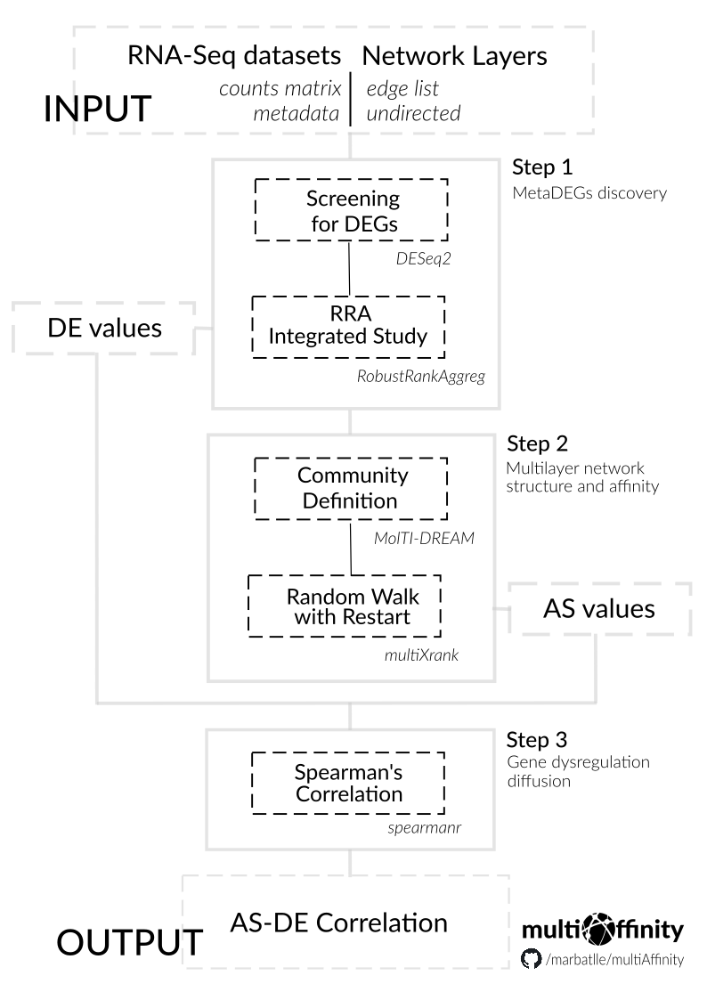
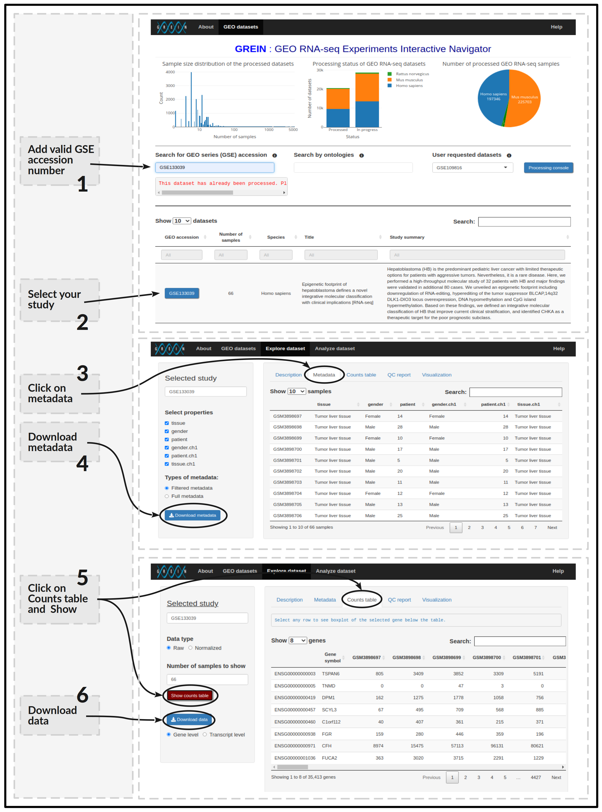

 

 

# Overview

Study how gene dysregulation propagates on a (multilayer) network, following the approach detailed in this this [video](https://www.youtube.com/watch?v=1tcwczu47aI&t=10s). This is the simplified framework of this bioinformatics analysis:
 

 
 

# Quick start 

## from Docker

    - Pull image
        docker pull marbatlle/multiAffinity
        
    - Run tool
        docker run -ti -v "$(pwd)/sample_data:/tool/sample_data" -v "$(pwd)/output:/tool/output" marbatlle/multiaffinity multiaffinity <ARGUMENTS>

    - Arguments e.g.
        -o output -c sample_data/sample1_data.csv,sample_data/sample2_data.csv -m sample_data/sample1_metadata.csv,sample_data/sample2_metadata.csv -n sample_data/sample1_layer.csv,sample_data/sample2_layer.csv
## from Github Packages

    - Pull image
        docker pull marbatlle/multiAffinity
        
    - Run tool
        docker run -ti -v "$(pwd)/sample_data:/tool/sample_data" -v "$(pwd)/output:/tool/output" marbatlle/multiaffinity multiaffinity <ARGUMENTS>

    - Arguments e.g.
        -o output -c sample_data/sample1_data.csv,sample_data/sample2_data.csv -m sample_data/sample1_metadata.csv,sample_data/sample2_metadata.csv -n sample_data/sample1_layer.csv,sample_data/sample2_layer.csv
    
 
 

# Usage
## Input
Before running the multiAffinity, the input files need to be curated to fit the tool's template. These consist of: **counts matrix**, **metadata** and **network layers**.

Respect the first two file types, the is designed to work seamlessly with the output created by [GREIN](http://www.ilincs.org/apps/grein/?gse=). This is how:

If your desired dataset/s have not been processed by GREIN, please, request its processing and check its progress at the Processing Console. On the other hand, if you want to use datasets not available at GEO, make sure that your files format match the following requirements:

### -- Metadata
* The files should be named following -- *sampleid*_metadata.csv
* Make sure metadata labels contain the word Normal

Sample file:

    ,tissue type
    GSM2177840,Normal
    GSM2177841,Normal
    GSM2177842,Tumor
    GSM2177843,Normal

### -- Counts Matrix
* The files should be named following -- *sampleid*_data.csv
* Make sure counts matrix includes gene symbols.
* The series accession identifiers (GSM) should match the ones on the metadata file.

Sample file:

    ,gene_symbol,GSM2177840,GSM2177841,GSM2177842,GSM2177843
    ENSG00000000003,TSPAN6,2076,1326,457,598
    ENSG00000000005,TNMD,0,0,0,0,1
    ENSG00000000419,DPM1,321,228,56,157
    ENSG00000000457,SCYL3,236,176,118,131

Remember, counts matrix and metadata have to share the same *sampleid* identifier.

### -- Network Layers

The last input required is a gene-gene network consisting of one or multiple layers in which nodes represent genes and edges represent different types of associations. Note that each layer should be added as a separate file.

Sample file:

    CNBP,HNRNPAB
    CNBP,RPL10A
    CNBP,CENPN
    CNBP,RSL24D1
    CNBP,SMAP
    CNBP,FTSJ3
    CNBP,TRA2B
 

## Run the script

Execute the script:

    usage: multiAffinity [-h] [-a Approach] -o Output Path  -c Counts Path -m Metadata Path
                         -n Network Path [-b Adjusted p-value] [-d DESeq2 - LFC cutoff]
                         [-e Control ID] [-f multiXrank - R value] [-g multiXrank - Selfloops]
                         [-i MolTI-DREAM - Modularity] [-j MolTI-DREAM - Louvain]

    arguments:
        -h                          show this help message and exit
        -a Approach                 computes correlation on each community or respect all genes, local or global approach *(default is local)*[opt]
        -o Output Path              defines name for output directory
        -c Counts Path              path to counts matrix, use sep ','
        -m Metadata Path            path to metadata, use sep ','
        -n Network Path             path to network, use sep ','
        -b Adjusted p-value         sets significance value for DESeq2, RRA, and Spearman's Corr *(default is 0.05)*[opt]
        -d DESeq2 - LFC cutoff      defines whether self loops are removed or not, takes values 0 or 1 *(default is 1)* [opt]
        -e Control ID               defines metadata label for the control samples *(default is Normal)* [opt]
        -f multiXrank - R value     lobal restart probability for multiXrank, given by float between 0 and 1 *(default is 0.15)* [opt]
        -g multiXrank - Selfloops   defines whether self loops are removed or not, takes values 0 or 1 *(default is 1)* [opt]
        -i MolTI-DREAM - Modularity sets Newman modularity resolution parameter on molTI-DREAM *(default is 1)* [opt]
        -j MolTI-DREAM - Louvain    switches to randomized Louvain on molTI-DREAM and sets num. of randomizations *(default is 5)* [opt]
 

## Output Files

All output files obtained in this computational study are available in the folder /output. Since there is multiple output files, for convenience, we also provide a spreadsheet file including the key results retrieved from the output files.

**Output Report:** found at *multiAffinity_report.csv*

|metaDEGs|AS-DE Corr|Community Size|Community ID|log2FC |Participation Coefficient|Overlap Degree|
|--------|----------|--------------|------------|-------|-------------------------|--------------|
|ADH1C   |-0.6715   |11            |11          |-4.7742|0.1038                   |75            |

**Multilayer Metrics Plot:** found at *output/multilayer_metrics_plot.png*, if output consists of more than one result

#### Additional results folder

**metaDEGs/**
- *degs_report.txt*: displays the number of upregulated and downregulated DEGs obtained individually from each study.
- *metaDEGs.txt*: describes all the obtained metaDEGs and the corresponding RRA Score.
- *wasserstein.txt*: remarks every pair of studies that show a significant difference between their distributions.

**Affinity**

- *RWR_matrix.txt*: output of random walks

**Communities**

- *molti_output.txt*: lays out the different communities defined by Molti-DREAM.
- *size_communities.txt*: presents the secondary output obtained by Molti-DREAM, indicating the sizes of each community by layer

 

-------------------------------------------------------------------------

 

